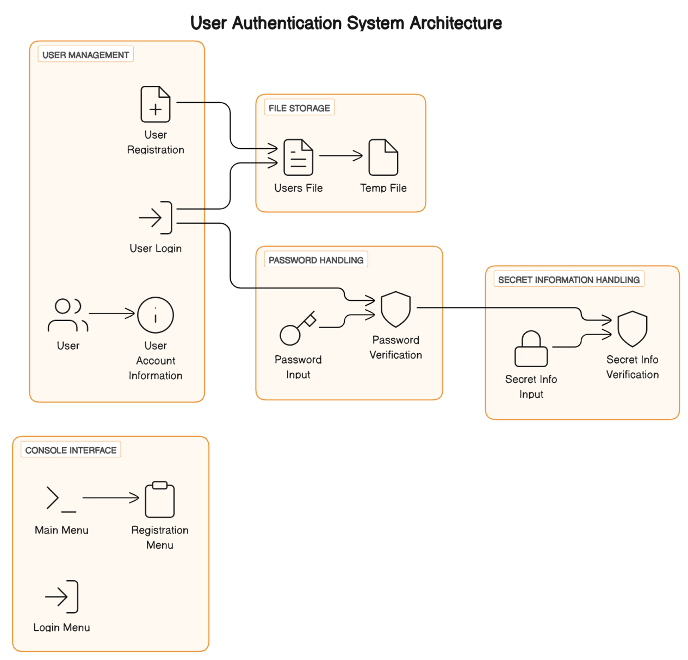

# Authentication System with or without Admin


Welcome to the Authentication System, a C++ application designed for secure user registration and login. This project features strong password requirements, username validation, secret information for recovery, and account blockage for multiple failed login attempts.


## TABLE OF CONTENTS

- #### Introduction
- #### Features
- #### Setup
- #### Usage

- ###### Main Menu
- ###### Registration
- ###### Login


- #### File Structure

- #### Code Overview
- ##### User Class
- ##### Function Definitions
- ##### Platform-Specific Functions


# Introduction
This project implements a secure user authentication system with functionalities for user registration, login, and account management. It ensures robust password policies, secret information handling, and account lock mechanisms for enhanced security.

## FEATURES

- User Registration: Secure user registration with strong password requirements and username validation.

- User Login: Secure user login with password and secret information verification.

- Account Management: Display user account information and retrieve secret information.

- File Handling: Persistent storage of user data using file streams.

- Platform Compatibility: Password input handling for both Windows and non-Windows platforms.


# explanantion


### Main Menu



## 1.Main Menu:
 The program starts by displaying a main menu with three options:
#### Registration(1),Login(2),and Exit(3).

## 2.Registration(registerUser):
 If the user selects option 1 (Registration):
 The program prompts the user to enter a desired username.
 Validates the username based on more than 5 characters, must include at least one digit, and must include '@'
 If the username is invalid,it prompts the user with specific error messages.
 If the username is valid,the program prompts the user to enter a password with specific requirements(length,uppercase,digit or symbol).
 If the password is invalid,it provides error messages and continues the loop until a valid password is entered.
 The program then prompts the user to confirm the password.
 If the confirmation fails,the process restarts.
 After successful confirmation,the program prompts the user to enter secret information.
 The user is then registered,and the information is written to the"users.txt"file.
 A success message is displayed,and the user is returned to the main menu.
 
## 3.Login(loginUser):
 If the user selects option 2(Login):
 The program prompts the user to enter a username.
 It searches for the username in the"users.txt"file.
 If the username is found,the program prompts the user to enter a password.
 If the password is incorrect,the program provides the remaining login attempts and may eventually ask for secret information.
 If the secret information is incorrect,the program provides the remaining attempts and may eventually block the account.
 If the account is blocked,the user is informed,and the program returns to the main menu.
 If the login is successful,a welcome message is displayed,and the program returns to the main menu.
 If the username is not found,an error message is displayed,and the user is prompted to try again.
 
## 4.Exiting the Program:
 If the user selects option 3(Exit):
 The program displays an exit message and terminates.
 
## 5.Console Clearing(system("cls")):
 The use of system("cls")is platform-dependent and is employed for a cleaner menu display.On some systems,you might see a different behavior(e.g.,system("clear")for Unix-like systems).
 
## 6.File Handling(ifstream and ofstream):
 The program reads user information from the"users.txt"file during login and appends new user information during registration.
 It also updates the file in case of account blockage.
 
## 7.Error Handling:
 The program provides detailed error messages for invalid username,password,and unsuccessful login attempts.
 It informs the user about account blockage due to too many incorrect attempts.
 
## 8.Password Input Masking(getPasswordInput):
 The program masks the password input with asterisks for security,and backspace is handled for corrections.
 
## 9.Account Blockage:
 If there are too many failed login attempts,the account is blocked,and the user is informed.The program then prompts for secret information to unblock or permanently blocks the account.
 
## Note:
 The actual output may vary based on user input during runtime.
 The user interaction makes it suitable for a console-based application with features like registration,login,and basic account security.


## EXPECTED OUTPUT OF THIS PROGRAM:
 Upon execution,the program greets the user with a main menu,presenting three options:registration,login,or program exit.The menu is displayed in a clear and organized format.

 If the user chooses registration,they are guided through the process,entering a desired username that meets specific criteria.The program ensures the uniqueness of the username,checks for the inclusion of an'@'symbol,and verifies the presence of a digit.The user is prompted to input a password,adhering to length requirements and including at least one uppercase letter and either a digit or symbol.Confirmation of the password is sought,followed by the entry of secret information.
 
 Successful registration prompts a confirmation message,indicating that the user has been registered.The user's information,including username,password,and secret information,is stored in the"users.txt"file.
 If the user opts for login,they are prompted to enter their username.The program searches for the username in the"users.txt"file.If found,the user is prompted to enter their password securely,with each incorrect attempt displaying the remaining chances.If the password is correct,a welcome message is displayed,signaling a successful login.

 In the event of repeated failed login attempts,the program prompts the user to verify their identity by entering secret information.Successful verification reveals the user's password,providing access to their account.However,failure to verify secret information results in the permanent blocking of the user's account.The program updates the"users.txt"file accordingly,reflecting the blocked status.

Throughout the interactions,the program outputs various messages to guide the user,such as notifications about invalid choices,failed login attempts,and successful operations.The console is periodically cleared for a cleaner user interface.

 Ultimately,the program allows users to seamlessly navigate through the registration and login processes while maintaining a secure environment.The output messages are designed to be informative,guiding users through each step and providing feedback on the success or failure of their actions.

## File Structure


```bash
├── users.txt            # Text file storing user data
├── main.cpp             # Main source code file
└── README.md            # Project documentation

```


## CODE-OVERVIEW 

### User Class
Handles user operations:

- Attributes: username, password, secretInfo, blocked.

- Constructors: Default and parameterized constructors.

- Methods:

```bash
userRetrieveSecretInfo()
```
 Displays user's secret information.
```bash
showAccountInformation()
```
### Displays user's account information.

Function Definitions
isUsernameTaken(const string& username): Checks if the given username is already taken.
```bash
registerUser()
```
 Handles user registration with username and password validation.
```bash
loginUser()
```
 Authenticates a user and handles login attempts, secret information verification, and account blocking.

### Platform-Specific Functions
Windows:
```bash
getPasswordInput()
```
Handles secure password input with masked characters on Windows platforms.

Non-Windows:
```bash
getPasswordInput():
```
 Handles secure password input with masked characters on POSIX-compliant platforms.
## 
