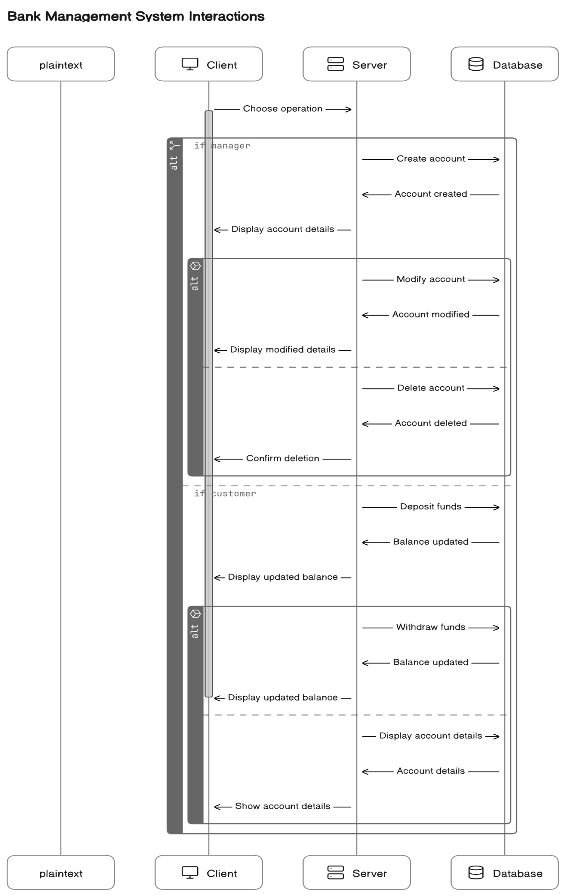

# Bank Management System

Welcome to my 2nd semester's " Bank_Management_System " project, i tried to build a C++ application designed to manage bank accounts efficiently. This project includes features for both managers and customers, providing a user-friendly interface for all banking operations.


## TABLE OF CONTENTS

- #### Introduction
- #### Features
- #### Setup
- #### Usage

- ###### Main Menu

- ###### Manager Menu

- ###### Customer Menu

- #### File Structure

- #### Code Overview
- ##### Account Class
- ##### Manager Functions
- ##### Customer Functions

- #### Login and Introduction

## INTRODUCTION

This project implements a simple banking system with functionalities for account creation, modification, deletion, deposit, withdrawal, and balance inquiry. It uses file handling to store account data persistently.

## FEATURES

- Manager Login: Secure login for managers.

- Account Management: Create, modify, and delete accounts.

- Customer Menu: Deposit, withdraw, and check balance.

- File Handling: Persistent storage of account data using file streams.


# USAGE


### Main Menu
- Login as Manager: Enter the manager's username and password to access the manager menu.

- Login as Customer: Access the customer menu for transactions.

- Exit: Quit the application.

### Manager Menu
#### New Account:

- Purpose: Create a new bank account.

- Details: Enter the account number, account holder’s name, account type (Savings/Current), and initial deposit. Validates account number to be exactly 7 digits.

#### All Account Holder List:

- Purpose: Display a list of all account holders.

- Details: Shows account number, holder name, account type, and balance for all accounts.

#### Close an Account:

- Purpose: Delete an existing account.

- Details: Enter the account number to remove the account from the database.

#### Modify an Account:

- Purpose: Update details of an existing account.

- Details: Enter the account number, and update the name, account type, and balance.

#### Return to Main Menu:

- Purpose: Go back to the main menu.

#### Exit:

- Purpose: Quit the application.

### Customer Menu
#### Deposit Amount:

- Purpose: Add funds to an account.

- Details: Enter the account number and amount to deposit.

#### Withdraw Amount:

- Purpose: Withdraw funds from an account.

- Details: Enter the account number and amount to withdraw, ensuring sufficient balance.

#### Balance Enquiry:

- Purpose: Check the balance of an account.

- Details: Enter the account number to view the current balance.

#### Return to Main Menu:

- Purpose: Go back to the main menu.

#### Exit:

- Purpose: Quit the application.
## File Structure


```bash
├── account.dat          # Binary file storing account data
├── main.cpp             # Main source code file
└── README.md            # Project documentation
```


## CODE-OVERVIEW 

### Account Class
Handles account operations:

```bash
 create_account()

``` 
 Create a new account. Validates the account number to ensure it is 7 digits long. Prompts for account holder’s name, account type (Savings/Current), and initial deposit (>=500 for Savings, >=1000 for Current).

```bash 
 show_account()
```
 Display account details including account number, holder’s name, type, and balance.

```bash
modify()
```
 Modify account details such as holder’s name, account type, and balance.

```bash
dep(int x)
```
 Deposit money into the account.

```bash
draw(int x)
```
Withdraw money from the account.

```bash
report() const
```
 Display account details in a report format.

```bash
retacno() const
```
 Return the account number.

```bash
retdeposit() const
```
 Return the account balance.

```bash
rettype() const
```
 Return the account type.

### Manager Functions
```bash
write_account()
```
Write new account details to the file.

```bash
display_all()
```
 Display all accounts along with their details.
```bash
delete_account(int n)
```
 Delete an account specified by the account number.
```bash
modify_account(int n)
```
 Modify details of an account specified by the account number.

### Customer Functions
```bash
deposit_withdraw(int n, int option)
```
 Handle deposit and withdrawal transactions based on the account number.
```bash
display_sp(int n)
```
 Display specific account details based on the account number.

## Login and Introduction
```bash
manager_login()
```
Check manager credentials (username and password).
```bash
intro()
```
 Display program introduction.
## 


